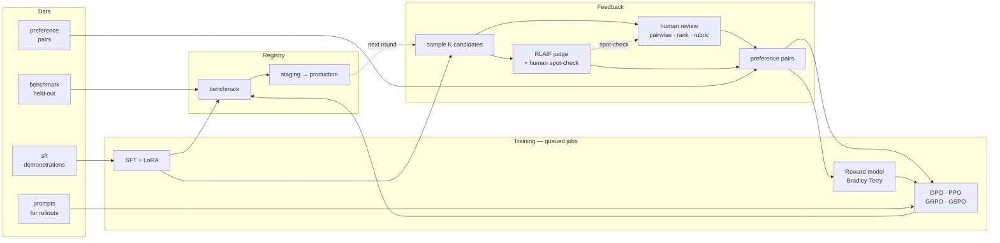

# SLM Foundry

**Bring your data. Get a fine-tuned small language model.**

A self-hosted product for teams that want their own small models: upload training
and benchmarking data, fine-tune with LoRA, collect preference feedback from
humans or an AI judge, align with the RLHF method you choose, benchmark, and
promote. Everything long-running runs on shared workers behind a fair-share
queue, so several teams share one deployment without queueing behind each other.



---

## Run it

```bash
pip install -r requirements.txt
PYTHONPATH=src python scripts/seed.py     # demo teams, users, four datasets
./scripts/serve.sh                        # API on :8200 + one worker
```

Open <http://127.0.0.1:8200> and sign in as `admin@foundry.local` / `foundry-demo`.

To scale out, run more workers against the same database — and split them by job
kind so interactive work never queues behind an overnight retrain:

```bash
# GPU box: training only
FOUNDRY_DATABASE_URL=postgresql+psycopg://db/foundry python -m foundry.worker --kinds train

# small box: candidate generation, judging, evaluation
FOUNDRY_DATABASE_URL=postgresql+psycopg://db/foundry python -m foundry.worker --kinds generate,judge,eval,assemble
```

## Documentation

Two searchable manuals in [`docs/`](docs/) — open [`docs/index.html`](docs/index.html)
in a browser, or go straight to one:

| | |
|---|---|
| [**User manual**](docs/user-manual.html) | Operating the product, beginner → advanced. Vocabulary, your first fine-tune, reading results, the review console, choosing a method, tuning, troubleshooting. |
| [**Methods manual**](docs/methods.html) | The techniques themselves, with the mathematics. LoRA, SFT, Bradley–Terry, DPO (+IPO/cDPO/RPO), PPO, GRPO, GSPO, RLAIF, reward functions, evaluation, review statistics. |

Press `/` in either to search.

### Verify the whole thing

```bash
PYTHONPATH=src:scripts python scripts/smoke.py
```

Seventeen checks covering every pipeline, the queue's lease protocol, tenancy
isolation, the failure path, and the audit chain — about a minute, no GPU, no
downloads. See **The tiny backend** below for what that does and does not prove.

---

## What each pipeline is for

| Method | Needs | Use it when |
|---|---|---|
| **SFT** | demonstrations | Always first. Every preference method assumes a policy that is already competent at the task. |
| **DPO** | preference pairs + a policy | The default way to spend preference data. No reward model, no sampling loop, hardest to destabilise. Variants: sigmoid, IPO, hinge, cDPO label smoothing, RPO auxiliary NLL. |
| **Reward model** | preference pairs | A Bradley-Terry scorer. Required by PPO; useful elsewhere as an offline evaluator. |
| **PPO** | prompts + reward model + policy | Most control and most moving parts. Learned critic, GAE, clipped surrogate, adaptive KL control. |
| **GRPO** | prompts + a reward signal | PPO with the critic deleted. Samples a group per prompt and uses the group mean as the baseline — half the memory, no value-function bugs. |
| **GSPO** | prompts + a reward signal | GRPO for long generations. Importance ratios and clipping move to the sequence level. |
| **RLAIF** | prompts + a policy | Replaces the *labelling* step, not the optimiser. A judge model ranks candidates into pairs, then DPO, GRPO or GSPO consumes them. |

### GRPO vs GSPO, since they look alike

Both use a group of *G* samples per prompt and the group's mean reward as the
baseline. They differ in where the importance ratio lives:

```
GRPO   r_{i,t} = π_θ(y_{i,t}) / π_old(y_{i,t})          ← per token
       L = −(1/Σ|y_i|) Σ_i Σ_t min( r_{i,t}·A_i , clip(r_{i,t}, 1±ε)·A_i )

GSPO   s_i = ( π_θ(y_i) / π_old(y_i) )^(1/|y_i|)        ← per sequence
       L = −(1/N) Σ_i min( s_i·A_i , clip(s_i, 1−ε_lo, 1+ε_hi)·A_i )
```

The advantage `A_i` is a *sequence*-level quantity — one reward for the whole
completion. GRPO nonetheless applies a per-token correction to it, so a
500-token generation accumulates 500 independently noisy ratios against a single
reward, and one token whose probability moved sharply can dominate. Clipping
cannot help, because it clips each token separately. GSPO matches the granularity
of the correction to the granularity of the reward.

That length normalisation is also why GSPO's clip ranges look absurd next to
PPO's: a geometric mean over hundreds of tokens sits extremely close to 1.0, so
`3e-4` is the *equivalent* strictness. Copying PPO's `0.2` across disables
clipping entirely. The defaults in `configs/foundry.json` reflect this, and the
trainer warns when the observed clip fraction says the setting is wrong.

---

## Data formats

Upload JSONL or a JSON array. Rows are validated and normalised on the way in;
malformed rows are reported with line numbers and dropped rather than failing the
upload, and the dropped count is recorded on the dataset.

```jsonc
// sft — either shape
{"messages": [{"role":"user","content":"…"}, {"role":"assistant","content":"…"}]}
{"prompt": "…", "completion": "…"}
{"messages": [{"role":"system","content":"…"}, {"role":"user","content":"…"}], "completion": "…"}

// preference
{"prompt": "…", "chosen": "…", "rejected": "…", "margin": 0.8}

// prompts — for RL rollouts and review batches
{"prompt": "…", "meta": {"topic": "…"}}

// benchmark — any combination scores appropriately
{"prompt": "…", "reference": "…"}                                  // exact match + token-F1
{"prompt": "…", "choices": ["A","B","C"], "answer": "B"}           // accuracy by likelihood
{"prompt": "…", "rubric": "…"}                                     // judge score
```

Multiple choice is scored by **length-normalised likelihood ranking**, not by
generating and string-matching: a small model that knows the answer but phrases
it loosely would otherwise be marked wrong, which measures formatting compliance
rather than knowledge.

---

## The review console

Reviewers see a prompt and two or more candidate responses, and pick one — or say
`tie` / `both bad`, which are first-class verdicts because a forced preference
between equivalent answers is noise with a label attached. Keyboard-driven:
`1`/`2` to pick, `T` tie, `B` both bad, `S` skip, `↵` submit.

Four properties make the resulting data worth training on:

- **Assignment is sampled, not sorted.** A "hardest first" queue is a
  deterministic policy with an unknown propensity, which biases every rate later
  estimated from the reviewed data. The eligible pool is softmaxed and sampled,
  and the resulting probability is stored on the assignment — that number is what
  lets a win-rate measured on reviewed items say anything about the ones nobody
  reviewed. It becomes an inverse-propensity weight on the preference pair.
- **Candidate order is shuffled per reviewer**, deterministically, so a refresh
  does not reorder mid-decision and two reviewers do not share a position bias.
- **Consensus sets the training weight.** A 5-0 split pushes the policy further
  than a 3-2 split; disagreement past the threshold routes the item to a lead for
  adjudication instead of being settled by majority-of-two.
- **The AI judge's answer is collapsed by default.** A reviewer who reads it
  first is confirming it, not judging — and the overlap between the two is the
  only measurement of whether the judge can be trusted on this task.

### RLAIF, and how it is kept honest

The judge scores every comparison in **both presentation orders** and the
disagreement rate is reported; a judge that flips on a third of its comparisons
is a coin weighted by presentation order. Pairs it could barely separate are
discarded. A configurable fraction of judged pairs is routed to humans, and the
**Agreement** tab reports raw agreement *and* Cohen's kappa — because raw
agreement on a two-way choice starts at 50% for a pair of coin flips and looks
respectable when it means nothing.

Without `ANTHROPIC_API_KEY`, RLAIF falls back to `heuristic-v1`, a mechanical
scorer (reference overlap, repetition, length plausibility, prompt echo). It is
labelled `heuristic-v1` in every record it writes, so nothing downstream can
mistake it for a model's judgement.

---

## The queue

A database table, not a broker. These jobs are minutes-to-hours long and arrive a
few per minute; a broker optimised for 100k messages/second buys nothing at that
volume and costs an extra service to operate plus a second source of truth that
drifts from the one the UI reads. Two properties do have to be right:

- **Exactly-once claim.** A worker takes a job with a conditional `UPDATE … WHERE
  status = 'queued'`. Two workers racing produce one `rowcount=1` and one
  `rowcount=0`. Correct on SQLite and Postgres, no locking protocol.
- **No permanently stuck jobs.** Claims write an expiry and every later write is
  conditional on still holding the lease token. A worker that is SIGKILLed or
  partitioned simply stops renewing; the reaper requeues at expiry and the
  zombie's late writes hit `rowcount=0`.

Fair share is deliberately **not** strict priority — candidates are ordered by
how many jobs the team already has running *first*, so one team's overnight sweep
of 400 jobs cannot monopolise every worker.

Cancellation is cooperative: trainers check between steps, because a process
killed mid-optimiser-step leaves a torn checkpoint.

---

## The tiny backend

When the requested base model is not present locally, runs fall back to `tiny`: a
randomly-initialised two-layer GPT-2 with a word-level vocabulary built from the
uploaded dataset. **The objective code is identical** — the same LoRA injection,
the same DPO log-ratio, the same PPO clipped surrogate with GAE, the same GRPO
baseline and GSPO sequence ratio. Only the model is small enough to train on a
laptop CPU in seconds.

It exists so the pipeline is verifiable (a four-minute test exercising all seven
methods for real catches an off-by-one in a log-prob mask; a test that stubs the
model out catches nothing), and so a team can evaluate the product before
provisioning hardware.

It produces **real loss curves and gibberish generations**. Every run records its
backend, and tiny-backend runs are tagged amber everywhere they appear so the
distinction survives a screenshot. Set `FOUNDRY_BACKEND=torch` to fail loudly
instead of falling back.

---

## Layout

```
slm-foundry/
  configs/foundry.json          method catalogue — the wizard's forms and the
                                trainers' validation read the same block
  src/foundry/
    api.py            FastAPI surface; nothing slow runs in a handler
    queue.py          fair-share scheduling, leases, reaping
    worker.py         the only module that knows both the DB and the trainers
    models.py         ORM — read the docstring before changing it
    datasets.py       ingest, validation, deterministic hash split
    review.py         assignment, consensus, IPW, pair assembly
    judge.py          Claude judge + the labelled offline fallback
    rewards.py        reward model | judge | verifier, one signature
    evaluate.py       benchmarking and pairwise comparison
    registry.py       versions, atomic promotion, lineage
    trainers/
      lora.py         adapters; `adapters_disabled()` is the reference policy
      policy.py       batching, masks, log-probs, sampling, value/reward heads
      sft.py  dpo.py  reward.py  ppo.py
      group_rl.py     GRPO and GSPO — they differ in one place, so they share a file
      rlaif.py        judge → pairs → your chosen optimiser
      tiny.py         the laptop backend
  static/             the console: index.html, styles.css, app.js
  scripts/            seed.py · smoke.py · serve.sh
```

## Configuration

| Variable | Default | Notes |
|---|---|---|
| `FOUNDRY_DATABASE_URL` | `sqlite:///./foundry.db` | Use Postgres with more than one worker. |
| `FOUNDRY_DATA_DIR` | `./var` | Uploads, run artifacts, promoted models. |
| `FOUNDRY_BACKEND` | `auto` | `auto` \| `torch` \| `tiny`. |
| `ANTHROPIC_API_KEY` | — | Enables the Claude judge; without it, `heuristic-v1`. |
| `FOUNDRY_CONFIG` | `configs/foundry.json` | Method catalogue and defaults. |

## Roles

`viewer` → `member` (upload data, launch runs) → `reviewer` (annotate) →
`lead` (adjudicate, promote) → `admin` (teams, quotas, users).

Every tenant row carries `team_id` directly and the API's single row accessor
filters on it, so tenancy is never one forgotten `.where()` away.

## Before this faces the open internet

Stated plainly rather than buried: password hashing is PBKDF2-HMAC-SHA256 from
the standard library — deliberate, to avoid a native dependency for a self-hosted
tool, and the piece to swap for argon2id or an SSO integration first. Token
storage is already right: only the SHA-256 of a bearer token is persisted, so a
database dump does not hand over live sessions.
